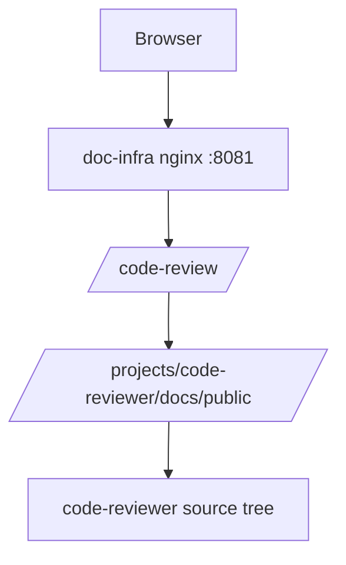

# Phase 2 Task Plan — 本機專案 Artifact 發布 MVP

日期：2026-07-01  
狀態：Ready for Developer  
上位設計：`docs/arch/doc_infra_docs_hub_migration_hld.md`  
上一階段 handoff：`docs/agent_context/phase1_cloud_vm_foundation/phase_handoff.md`  
風險分級：🟢 LOW — 只搬遷單一低風險 pilot project 的公開文件 artifact，不導入 SFTPGo / builder / validator / Pagefind，不新增公開 port。

---

## 1. 需求確認

### 1.1 任務目標

建立「本機專案 → artifact → `/doc-sites` / `DOC_INFRA_PUBLIC_ROOT` → nginx 對外曝光」的最小可行發布流程，先選一個低風險專案作為 pilot。

Phase 2 pilot project：

| 欄位 | 值 |
|---|---|
| project | `code-reviewer` |
| source path | `/home/ubuntu/projects/code-reviewer/docs/public/` |
| current route | `/code-review/` |
| current alias | `/projects/code-reviewer/docs/public/` |
| target artifact root | `${DOC_INFRA_PUBLIC_ROOT:-/home/ubuntu/doc-sites}/code-reviewer/` |
| target nginx alias | `/doc-sites/code-reviewer/` |

### 1.2 成功標準

| 項目 | 成功標準 |
|---|---|
| Artifact 發布 | `code-reviewer/docs/public/` 被複製到 `${DOC_INFRA_PUBLIC_ROOT:-/home/ubuntu/doc-sites}/code-reviewer/` |
| 路由搬遷 | `nginx/conf.d/locations/code-review.conf` 改為 `alias /doc-sites/code-reviewer/;` |
| 首頁 metadata | `html/config.json` 中 `code-reviewer.static_root` 改為 `/doc-sites/code-reviewer/` |
| URL 相容 | `http://localhost:8081/code-review/` 仍回傳 200 |
| 安全邊界 | 不新增 `/files/`、不新增 public `/projects` route、`/doc-sites` 仍 read-only mount |
| 可重跑 | 發布腳本可重複執行，並避免把 source code / `.env` 發布進 artifact |

### 1.3 驗證方式

Developer 需至少執行或提供可執行說明：

```bash
bash scripts/publish-local-artifact.sh code-reviewer
docker compose config
docker exec doc-infra-nginx nginx -t
docker exec doc-infra-nginx nginx -s reload
curl -s -o /dev/null -w "%{http_code}" http://localhost:8081/code-review/
curl -s -o /dev/null -w "%{http_code}" http://localhost:8081/code-review/../.env
curl -s -o /dev/null -w "%{http_code}" http://localhost:8081/files/
curl -s -o /dev/null -w "%{http_code}" http://localhost:8081/projects/
```

---

## 2. 系統架構掃描

### 2.1 上一階段 Handoff 摘要

Phase 1 已完成：

1. `DOC_INFRA_PUBLIC_ROOT` 與 `/doc-sites` read-only mount 抽象。
2. QA Validate PASS。
3. `/files/` 與 public `/projects/` 仍未暴露。
4. legacy `/projects` alias 待搬遷：
   - `company-profile.conf`
   - `code-review.conf`
   - `litellm-mvp.conf`

Phase 2 必須遵守：

1. 不假設 Cloud VM DNS/TLS 已完成。
2. 不導入 SFTPGo。
3. 先以低風險本機 artifact copy / rsync MVP 開始。

### 2.2 已讀取受影響檔案

| 檔案 | 觀察 |
|---|---|
| `docs/agent_context/phase1_cloud_vm_foundation/phase_handoff.md` | Phase 1 PASS；指定 legacy `/projects` 清單與 Phase 2 input |
| `docker-compose.yml` | `/doc-sites` 來自 `${DOC_INFRA_PUBLIC_ROOT:-/home/ubuntu/doc-sites}:/doc-sites:ro`；`/projects` legacy mount 仍存在 |
| `nginx/conf.d/doc-infra.conf` | include `/etc/nginx/conf.d/locations/*.conf`；`/files/` 註解關閉 |
| `nginx/conf.d/locations/code-review.conf` | `/code-review/` 目前 alias `/projects/code-reviewer/docs/public/` |
| `html/config.json` | `code-reviewer.static_root` 目前為 `/projects/code-reviewer/docs/public/` |
| `/home/ubuntu/projects/code-reviewer/docs/public/index.html` | pilot source artifact 存在，純公開 HTML 入口 |
| `/home/ubuntu/doc-sites` | 已作為現有 published/fallback root；目前未看到 `code-reviewer` artifact |

### 2.3 現有資料流



### 2.4 Phase 2 目標資料流

```mermaid
flowchart TD
    Source[/home/ubuntu/projects/code-reviewer/docs/public/]
    Script[scripts/publish-local-artifact.sh code-reviewer]
    Published[${DOC_INFRA_PUBLIC_ROOT:-/home/ubuntu/doc-sites}/code-reviewer/]
    Nginx[doc-infra nginx :8081]
    Route[/code-review/]

    Source --> Script
    Script --> Published
    Nginx --> Route
    Route -->|alias /doc-sites/code-reviewer/| Published
```

### 2.5 預期修改檔案

| 檔案 | 修改目的 |
|---|---|
| `scripts/publish-local-artifact.sh` | 新增本機 artifact 發布 MVP 腳本，支援 `code-reviewer` pilot |
| `nginx/conf.d/locations/code-review.conf` | 將 `/code-review/` alias 從 `/projects/...` 改為 `/doc-sites/code-reviewer/` |
| `html/config.json` | 將 `code-reviewer.static_root` 改為 `/doc-sites/code-reviewer/`；更新 `last_updated` |
| `README.md` | 補充本機 artifact 發布 MVP 操作與 Phase 2 pilot 狀態 |
| `docs/agent_context/phase2_local_artifact_mvp/development_log.md` | 記錄實作與驗證結果 |
| `docs/agent_context/phase2_local_artifact_mvp/phase_handoff.md` | Validate PASS 後填寫 |

本階段不應修改：

| 檔案/區域 | 原因 |
|---|---|
| `docker-compose.yml` | Phase 1 已完成 root abstraction；Phase 2 不改服務/port |
| `html/script.js`, `html/style.css` | Phase 2 不改 portal UI |
| `company-profile.conf`, `litellm-mvp.conf` | 本階段 pilot 只處理 `code-reviewer`，避免擴大範圍 |
| 新增 SFTPGo / builder / validator / Pagefind | 屬於後續 Phase |

---

## 3. 階段規劃

### 3.1 開發動作

#### Step 1 — 新增發布腳本

新增：

```text
scripts/publish-local-artifact.sh
```

要求：

1. `set -euo pipefail`。
2. 接收 project name，目前只允許 `code-reviewer`。
3. source 固定：`/home/ubuntu/projects/code-reviewer/docs/public/`。
4. target 使用：`${DOC_INFRA_PUBLIC_ROOT:-/home/ubuntu/doc-sites}/code-reviewer/`。
5. 若 source 不存在或缺 `index.html`，必須 fail fast。
6. 複製前掃描禁止項：`.env`、private key、`.git`、`src/`、`config/`、`node_modules/` 不可被發布。
7. 使用 staging temp + atomic-ish promote：先同步到 `${target}.tmp`，成功後替換 target。
8. 腳本輸出 summary：source、target、file count、是否成功。

#### Step 2 — 發布 pilot artifact

執行：

```bash
bash scripts/publish-local-artifact.sh code-reviewer
```

產物應出現在：

```text
${DOC_INFRA_PUBLIC_ROOT:-/home/ubuntu/doc-sites}/code-reviewer/index.html
```

#### Step 3 — 搬遷 nginx location

修改：

```nginx
location /code-review/ {
    alias /doc-sites/code-reviewer/;
    index index.html;
    autoindex off;
}
```

保留 `location = /code-review` redirect。

#### Step 4 — 更新首頁 metadata

修改 `html/config.json`：

```json
"static_root": "/doc-sites/code-reviewer/"
```

更新：

```json
"last_updated": "2026-07-01"
```

不得更改 `path`：仍為 `/code-review/`。

#### Step 5 — 更新 README

新增或更新「本機 artifact 發布 MVP」章節，描述：

1. Pilot project：`code-reviewer`。
2. source / target / route。
3. 執行發布腳本。
4. 驗證命令。
5. 回滾方式。
6. 後續尚未搬遷的 legacy `/projects` aliases。

---

## 4. 驗收標準

### 4.1 可量化 metric

| 指標 | 標準 |
|---|---|
| publish script exit code | 0 |
| artifact index | `${DOC_INFRA_PUBLIC_ROOT:-/home/ubuntu/doc-sites}/code-reviewer/index.html` 存在 |
| nginx config | `nginx -t` exit 0 |
| `/code-review/` | HTTP 200 |
| `/files/` | HTTP 404 或非 200 |
| `/projects/` | HTTP 404 或非 200 |
| forbidden files | artifact 中不得含 `.env`、private key、`.git`、`src/`、`config/` |

### 4.2 輸出欄位測試類別覆蓋矩陣 — `scripts/publish-local-artifact.sh` output

| 測試類別 | 檢查問題 | 測試案例 | 通過標準 |
|---|---|---|---|
| 🟢 正面測試 | 正常專案可發布 | `bash scripts/publish-local-artifact.sh code-reviewer` | exit 0，target 有 `index.html` |
| 🔴 負面測試 | 未允許專案不可發布 | `bash scripts/publish-local-artifact.sh unknown` | exit 非 0 且不建立 target |
| 📏 範圍測試 | 不應複製大型/非公開目錄 | artifact 掃描 `.git`, `node_modules`, `src`, `config` | 不存在 |
| 🎯 正確性測試 | target 與 source 公開內容一致 | 比對 `index.html` 存在與基本 title | `/code-review/` 顯示 Code Reviewer 文件 |
| 🔲 邊界測試 | source 缺 `index.html` 時 fail | 臨時指定或模擬缺 index | script fail fast，不 promote |

### 4.3 輸出欄位測試類別覆蓋矩陣 — `html/config.json` 的 `code-reviewer.static_root`

| 測試類別 | 檢查問題 | 測試案例 | 通過標準 |
|---|---|---|---|
| 🟢 正面測試 | 首頁 metadata 指向新 artifact root | `static_root=/doc-sites/code-reviewer/` | JSON valid，首頁 card path 不變 |
| 🔴 負面測試 | 不得繼續指向 `/projects` | grep `code-reviewer.*projects` | 無 `/projects/code-reviewer` |
| 📏 範圍測試 | path 格式合理 | static_root 必須以 `/doc-sites/` 開頭並 `/` 結尾 | 通過 |
| 🎯 正確性測試 | static_root 與 nginx alias 一致 | 比對 config 與 `code-review.conf` alias | 均為 `/doc-sites/code-reviewer/` |
| 🔲 邊界測試 | JSON 仍可解析 | `python3 -m json.tool html/config.json` | exit 0 |

### 4.4 輸出欄位測試類別覆蓋矩陣 — nginx `/code-review/` route

| 測試類別 | 檢查問題 | 測試案例 | 通過標準 |
|---|---|---|---|
| 🟢 正面測試 | `/code-review/` 正常服務 | curl `/code-review/` | 200 |
| 🔴 負面測試 | 路徑穿越不可讀 | curl `/code-review/../.env` | 非 200 |
| 📏 範圍測試 | alias 不指向 source tree | grep `alias /projects/code-reviewer` | 無結果 |
| 🎯 正確性測試 | nginx alias 指向 artifact | read conf | `alias /doc-sites/code-reviewer/;` |
| 🔲 邊界測試 | 無尾斜線 redirect | curl `/code-review` | 301 到 `/code-review/` |

---

## 5. Validate Gate 定義

QA 必須檢查：

1. Phase 1 handoff 已讀且 PASS。
2. 僅 pilot `code-reviewer` 被搬遷，不擴大到 `company-profile` 或 `litellm-mvp`。
3. `scripts/publish-local-artifact.sh` 可重跑、會 fail fast、只允許 `code-reviewer`。
4. `code-review.conf` alias 改為 `/doc-sites/code-reviewer/`。
5. `html/config.json` JSON valid，`code-reviewer.static_root` 改為 `/doc-sites/code-reviewer/`。
6. `/code-review/` 回傳 200。
7. `/files/`、`/projects/`、path traversal 均非 200。
8. 未新增公開 port、未新增 SFTPGo/builder/validator/Pagefind。
9. `development_log.md` 記錄實作與測試結果。
10. Validate PASS 後才能填寫 `phase_handoff.md`。

反饋迴圈：

| 項目 | 設定 |
|---|---|
| retry_count 初始值 | 0 |
| max_retry | 3 |
| FAIL 處理 | Developer 根據 QA report 修正，再次提交驗證 |
| retry_count >= 3 | 升級 User 判斷 |

---

## 6. 風險分級與 HITL 模式

本階段為 🟢 LOW。

理由：

1. 只搬遷單一低風險公開文件 project。
2. 不新增公開寫入面。
3. 不改 Docker service / port。
4. 可快速回滾 `code-review.conf` 與 `config.json`。

HITL 模式：

```text
🟢 LOW -> Auto / Validate Report 抽查
```

---

## 7. 任務邊界與禁止事項

### 7.1 本階段要做

1. 建立本機 artifact 發布腳本 MVP。
2. 發布 `code-reviewer` artifact 到 `/doc-sites/code-reviewer/`。
3. 搬遷 `/code-review/` route 至 `/doc-sites/code-reviewer/`。
4. 更新 `html/config.json` metadata。
5. 更新 README 與 development log。

### 7.2 本階段不做

1. 不導入 SFTPGo。
2. 不導入 validator / builder service。
3. 不導入 Pagefind。
4. 不搬遷 `company-profile` 或 `litellm-mvp`。
5. 不刪除 `/projects` docker mount。
6. 不重新開 `/files/`。
7. 不修改 portal UI。
8. 不改 Cloud VM DNS / Host Nginx / TLS 設定。

---

## 8. 其他影響因素

### 8.1 性能

純靜態文件 copy + nginx alias，性能風險低。

### 8.2 安全

主要風險是把非公開檔案複製到 public root，因此發布腳本必須限制 source 並掃描 forbidden patterns。

### 8.3 部署與回滾

回滾：

1. 將 `code-review.conf` alias 改回 `/projects/code-reviewer/docs/public/`。
2. 將 `html/config.json` 的 `code-reviewer.static_root` 改回 `/projects/code-reviewer/docs/public/`。
3. `docker exec doc-infra-nginx nginx -t && docker exec doc-infra-nginx nginx -s reload`。
4. 可保留或刪除 `/home/ubuntu/doc-sites/code-reviewer/` artifact，不影響舊路由。

### 8.4 監控與告警

Phase 2 僅需基本健康檢查：

```bash
curl -fsS http://localhost:8081/code-review/
```

### 8.5 文件與知識傳遞

完成後必須更新：

1. `README.md`
2. `development_log.md`
3. `phase_handoff.md`
