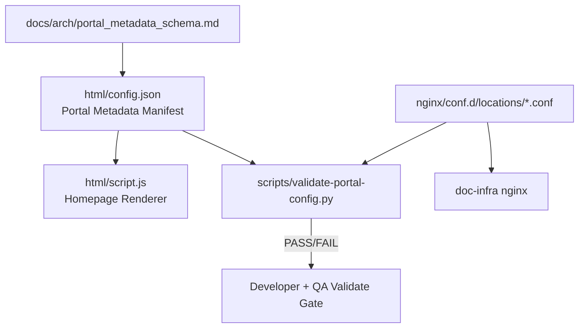

# Phase 3 Task Plan — Manifest 與 Portal Metadata 標準化

日期：2026-07-01  
狀態：Ready for Developer  
上位設計：`docs/arch/doc_infra_docs_hub_migration_hld.md`  
上一階段 handoff：`docs/agent_context/phase2_local_artifact_mvp/phase_handoff.md`  
風險分級：🟡 MEDIUM — 會標準化 portal metadata 並新增 validator，但不搬遷路由、不新增服務、不改公開 URL。

---

## 1. 需求確認

### 1.1 任務目標

Phase 3 目標是將目前手工維護的 `html/config.json` 從「首頁顯示清單」提升為可驗證的 portal metadata manifest，讓後續 Phase 4/5 的受控上傳、validator、promote 流程有穩定資料契約。

本階段必須完成：

1. 補齊 `html/config.json` 中每個 project 的標準欄位。
2. 對每個 project 加入 `static_root` 與 `publish_state`。
3. 新增 metadata schema 文件。
4. 新增 stdlib-only validator script，檢查 config 與 nginx location alias 的一致性。
5. 更新 README 說明 metadata contract。

### 1.2 成功標準

| 項目 | 成功標準 |
|---|---|
| Config 完整性 | `html/config.json` 每個 project 都有 `name`, `display_name`, `category`, `path`, `static_root`, `description`, `publish_state` |
| Schema 文件 | 新增 `docs/arch/portal_metadata_schema.md`，明確定義欄位、enum、相容性與範例 |
| Validator | 新增 `scripts/validate-portal-config.py`，可用 Python stdlib 執行 |
| Route 一致性 | validator 可檢查 project `path` 與 nginx `alias` 是否和 `static_root` 一致 |
| URL 相容 | 現有公開 routes 不變且仍可服務 |
| 安全邊界 | 不新增 `/files/`、不新增 public `/projects` route、不改 Docker service/port |

### 1.3 驗證方式

Developer 需至少執行：

```bash
python3 scripts/validate-portal-config.py
python3 -m json.tool html/config.json >/tmp/doc-infra-config-json-check.json
docker compose config
docker exec doc-infra-nginx nginx -t
curl -s -o /dev/null -w "%{http_code}" http://localhost:8081/code-review/
curl -s -o /dev/null -w "%{http_code}" http://localhost:8081/company-profile/
curl -s -o /dev/null -w "%{http_code}" http://localhost:8081/files/
curl -s -o /dev/null -w "%{http_code}" http://localhost:8081/projects/
```

---

## 2. 系統架構掃描

### 2.1 已讀取受影響檔案

| 檔案 | 觀察 |
|---|---|
| `docs/agent_context/phase2_local_artifact_mvp/phase_handoff.md` | Phase 2 PASS；Phase 3 input 指向 manifest / metadata schema、補齊 `company-profile-optimizer.static_root` |
| `html/config.json` | 目前 7 個 projects；`company-profile-optimizer` 缺 `static_root`；所有 project 缺 `publish_state` |
| `html/script.js` | portal 只使用 `last_updated`, `projects`, `category`, `path`, `display_name`, `description`, `name`；忽略額外欄位，因此可向後相容新增 metadata |
| `nginx/conf.d/doc-infra.conf` | include `locations/*.conf`；`/files/` 保持關閉 |
| `nginx/conf.d/locations/*.conf` | 大部分 alias `/doc-sites/...`；`company-profile.conf` 與 `litellm-mvp.conf` 仍 alias `/projects/...` |
| `scripts/publish-local-artifact.sh` | Phase 2 pilot script hardcoded `code-reviewer`；Phase 3 不改為多 project publisher |
| `docker-compose.yml` | `/doc-sites` 由 `${DOC_INFRA_PUBLIC_ROOT:-/home/ubuntu/doc-sites}` read-only mount；`/projects` legacy mount 仍保留 |

### 2.2 現有 config projects

| name | path | current static_root | inferred publish_state | nginx alias 狀態 |
|---|---|---|---|---|
| `optimize-search-pipeline` | `/pipeline/` | `/doc-sites/optimize-search-pipeline/` | `published` | `/doc-sites/optimize-search-pipeline/` |
| `bcas_quant` | `/bcas/` | `/doc-sites/bcas_quant/` | `published` | `/doc-sites/bcas_quant/` |
| `OrganBriefOptimization` | `/organic/` | `/doc-sites/OrganBriefOptimization/` | `published` | `/doc-sites/OrganBriefOptimization/` |
| `trade-data` | `/trade-data/` | `/doc-sites/trade-data/` | `published` | `/doc-sites/trade-data/` |
| `company-profile-optimizer` | `/company-profile/` | missing | `legacy` | `/projects/company-profile-optimizer/docs/public/` |
| `code-reviewer` | `/code-review/` | `/doc-sites/code-reviewer/` | `published` | `/doc-sites/code-reviewer/` |
| `litellm` | `/litellm/` | `/doc-sites/litellm/` | `published` | `/doc-sites/litellm/` |

### 2.3 目標資料契約



### 2.4 Architecture Review

**Summary:**  
Phase 3 設計方向合理：以 metadata contract + validator 建立後續 pipeline 的共同語言，同時不擴大 runtime surface。

**Strengths:**

- 將 `config.json` 標準化可降低 portal、nginx route、artifact publish 三者的 drift。
- validator 使用 Python stdlib，避免新增 runtime dependency。
- `publish_state` 明確區分 `published` 與 `legacy`，可在不強行搬遷的情況下揭露技術債。
- 不修改 `html/script.js` 可維持首頁相容性。

**Weaknesses / Mitigations:**

- **Issue:** Nginx conf parsing 以 regex/文字掃描實作，無法覆蓋所有 nginx 語法。  
  **Impact:** 複雜 conf 可能產生 false negative/positive。  
  **Suggestion:** Phase 3 validator 僅支援目前簡單 pattern：`location /path/ { alias ...; }`，並在 schema 文件中明確宣告限制。
- **Issue:** `legacy` project 仍指向 `/projects` source tree。  
  **Impact:** 仍存在後續搬遷債。  
  **Suggestion:** Phase 3 只標記狀態，不搬遷；Phase 4/5 再處理受控上傳與 promote。

---

## 3. 階段規劃

### 3.1 Step 1 — 新增 schema 文件

新增：

```text
docs/arch/portal_metadata_schema.md
```

內容必須定義：

| 欄位 | 型別 | 必填 | 規則 |
|---|---|---|---|
| `name` | string | yes | unique, non-empty |
| `display_name` | string | yes | non-empty |
| `category` | string | yes | 目前允許 `document`, `source` |
| `path` | string | yes | unique, starts and ends with `/` |
| `static_root` | string | yes | starts with `/doc-sites/` for `published`; starts with `/projects/` for `legacy` |
| `description` | string | yes | non-empty |
| `publish_state` | string | yes | enum: `published`, `legacy` |

### 3.2 Step 2 — 更新 `html/config.json`

每個 project 都必須補上 `publish_state`。

`company-profile-optimizer` 必須補上：

```json
"static_root": "/projects/company-profile-optimizer/docs/public/",
"publish_state": "legacy"
```

已在 `/doc-sites` 的 projects 使用：

```json
"publish_state": "published"
```

不得更動任何 project 的 `path`。

### 3.3 Step 3 — 新增 validator

新增：

```text
scripts/validate-portal-config.py
```

要求：

1. 只使用 Python stdlib。
2. 預設讀取 `html/config.json` 與 `nginx/conf.d/locations/*.conf`。
3. 驗證 JSON 可解析。
4. 驗證 top-level：`projects` list、`last_updated`、`mode`。
5. 驗證所有必填欄位。
6. 驗證 `name` 與 `path` unique。
7. 驗證 `publish_state` enum。
8. 驗證 `static_root` prefix 與 `publish_state` 一致。
9. 對每個 project 的 `path` 找到對應 nginx `location` alias，且 alias == `static_root`。
10. 清楚輸出 PASS / FAIL summary；失敗時列出 project name 與原因。

可接受限制：

- 僅解析目前簡單 nginx pattern：`location /xxx/ { alias /yyy/; }`。
- redirect-only location，例如 `/litellm-aws/`、`/litellm-mvp/` 不在 `html/config.json` project list，可不納入一致性檢查。

### 3.4 Step 4 — 更新 README

README 需補充：

1. Portal metadata 欄位契約。
2. `publish_state=published` vs `legacy`。
3. 執行 validator 的方式。
4. 新增/修改 project 時的 checklist。

### 3.5 Step 5 — 更新 development log

Developer 必須更新：

```text
docs/agent_context/phase3_manifest_metadata_standardization/development_log.md
```

---

## 4. 驗收標準

### 4.1 可量化 metric

| 指標 | 標準 |
|---|---|
| config JSON parse | `python3 -m json.tool html/config.json` exit 0 |
| validator | `python3 scripts/validate-portal-config.py` exit 0 |
| required field coverage | 100% projects have required fields |
| unique `name` / `path` | 0 duplicates |
| route contract | 0 changed public paths |
| nginx config | `nginx -t` exit 0 |
| security routes | `/files/` and `/projects/` non-200 |

### 4.2 測試類別覆蓋矩陣 — `html/config.json` 新增/修改欄位

| 測試類別 | 檢查問題 | 測試案例 | 通過標準 |
|---|---|---|---|
| 🟢 正面測試 | 所有 project 有完整 metadata | validator 檢查所有必填欄位 | exit 0 |
| 🔴 負面測試 | 缺欄位不可通過 | 使用 temp config 刪除 `static_root` 或 `publish_state` | validator exit 非 0 |
| 📏 範圍測試 | `publish_state` 僅允許 enum | temp config 設為 `unknown` | validator exit 非 0 |
| 🎯 正確性測試 | `static_root` 與 nginx alias 一致 | validator 比對 conf alias | 0 mismatch |
| 🔲 邊界測試 | path 格式必須首尾 `/` | temp config 設為 `code-review` | validator exit 非 0 |

### 4.3 測試類別覆蓋矩陣 — `scripts/validate-portal-config.py` output

| 測試類別 | 檢查問題 | 測試案例 | 通過標準 |
|---|---|---|---|
| 🟢 正面測試 | 合法 config 可通過 | `python3 scripts/validate-portal-config.py` | exit 0, prints PASS |
| 🔴 負面測試 | 不合法 config fail | 使用 `--config /tmp/bad-config.json` | exit 非 0, lists errors |
| 📏 範圍測試 | duplicate name/path fail | temp config 複製一個 path | exit 非 0 |
| 🎯 正確性測試 | alias mismatch fail | temp config 改 `static_root` | exit 非 0 |
| 🔲 邊界測試 | redirect-only conf 不造成 false fail | 保留 `/litellm-aws/` 不在 config | validator 不要求 config 包含 redirect-only route |

---

## 5. Validate Gate 定義

QA 必須檢查：

1. Phase 2 handoff 狀態為 PASS。
2. `docs/arch/portal_metadata_schema.md` 存在且欄位定義完整。
3. `html/config.json` 所有 projects 均有必填欄位。
4. `company-profile-optimizer.static_root` 已補齊，`publish_state=legacy`。
5. 已 published projects 的 `publish_state=published` 且 `static_root` 以 `/doc-sites/` 開頭。
6. `scripts/validate-portal-config.py` exit 0。
7. 至少一個 negative fixture / temp config 測試能讓 validator exit 非 0。
8. `docker exec doc-infra-nginx nginx -t` PASS。
9. 現有 routes 不變；`/files/`、`/projects/` 非 200。
10. `html/script.js` 與 `html/style.css` 未修改，除非 Developer 有明確理由且 QA 接受。
11. `phase_handoff.md` 在 QA PASS 前不得標示 PASS。

反饋迴圈：

| 項目 | 設定 |
|---|---|
| retry_count 初始值 | 0 |
| max_retry | 3 |
| FAIL 處理 | Developer 根據 QA report 修正 |
| retry_count >= 3 | 升級 User 判斷 |

---

## 6. 風險分級與 HITL 模式

風險：🟡 MEDIUM。

理由：

1. 修改 `html/config.json` metadata contract，影響首頁 project list。
2. 新增 validator 作為後續流程依賴。
3. 不改 URL / route / service，因此非 HIGH。

HITL 模式：

```text
🟡 MEDIUM -> Validate Report 抽審；若 validator schema 與現況衝突需人工確認。
```

---

## 7. 任務邊界與禁止事項

### 7.1 本階段要做

1. 標準化 portal metadata。
2. 補齊 `company-profile-optimizer.static_root`。
3. 新增 `publish_state`。
4. 新增 schema 文件與 validator。
5. 更新 README / development log。

### 7.2 本階段不做

1. 不搬遷 `company-profile` 到 `/doc-sites`。
2. 不搬遷 `litellm-mvp`。
3. 不修改 `scripts/publish-local-artifact.sh` 為多 project publisher。
4. 不新增 SFTPGo / builder / validator service / Pagefind。
5. 不改 Docker service / port。
6. 不重新啟用 `/files/`。
7. 不新增 public `/projects` route。
8. 不修改 portal UI (`html/script.js`, `html/style.css`)。

---

## 8. 其他影響因素

### 8.1 性能

Validator 是開發/QA 時執行，不在 request path。Runtime 性能影響為零。

### 8.2 安全

Phase 3 不直接改公開路由，但會把 legacy source-tree routes 明確標記為 `publish_state=legacy`，讓後續搬遷可追蹤。

### 8.3 部署與回滾

回滾方式：

1. 還原 `html/config.json` 至 Phase 2 版本。
2. 移除或忽略 `scripts/validate-portal-config.py` 與 schema 文件。
3. 不需 reload nginx，除非 Developer 意外修改 conf。

### 8.4 監控

新增日常檢查：

```bash
python3 scripts/validate-portal-config.py
```
