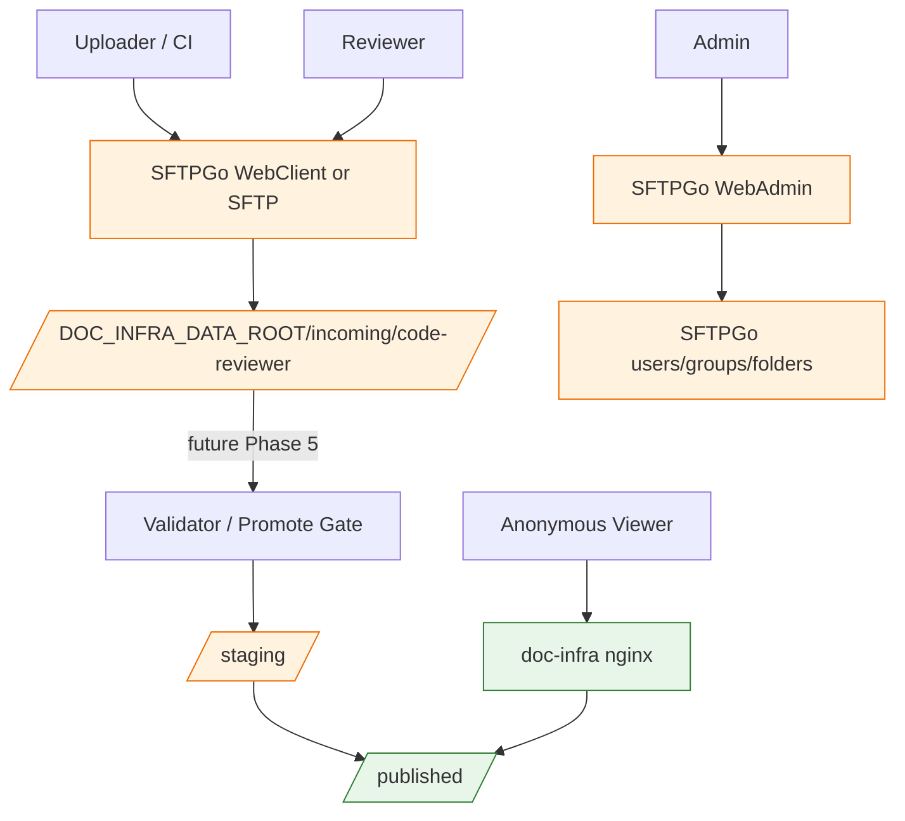

# Phase 4 Implementation Task Plan — SFTPGo Controlled Upload MVP

日期：2026-07-02  
狀態：Ready for Developer  
上位設計：`docs/arch/doc_infra_docs_hub_migration_hld.md`  
Planning handoff：`docs/agent_context/phase4_sftpgo_controlled_upload_planning/phase_handoff.md`  
Approval：User 已核准 recommended defaults  
風險分級：🔴 HIGH — 新增 authenticated upload surface、SFTPGo service、host-private ports 與權限面。

---

## 1. 需求確認

### 1.1 核准後的 implementation 目標

User 已核准 Phase 4 MVP recommended defaults：

```text
SFTPGo WebClient
+ private host port / IP allowlist style binding
+ code-reviewer pilot
+ SFTPGo local users
+ upload only to incoming/
+ no publish automation
+ no custom portal upload UI
+ defer email notification/event rules
```

本階段要建立受控上傳入口，但仍不讓上傳內容進入公開文件區。

### 1.2 成功標準

| 項目 | 成功標準 |
|---|---|
| SFTPGo service | `docker compose config` 可解析，`sftpgo` service 可啟動 |
| Private binding | SFTPGo Web UI / SFTP port 預設綁定 `127.0.0.1`，不直接公開到所有介面 |
| Data isolation | `incoming/`、`staging/` 不被 doc-infra nginx serve |
| Public safety | `/files/`、`/projects/` 維持 non-200 |
| No direct publish | SFTPGo 不 mount `DOC_INFRA_PUBLIC_ROOT` as writable，也不讓 user 寫 `/doc-sites` / `published` |
| Pilot scope | 初始設計只針對 `code-reviewer` incoming upload |
| No secrets | repo 不提交實際 admin password、user password、API key、private key |
| Docs | README + HLD 清楚描述初始化、手動建立 user/group、權限與 rollback |

---

## 2. 系統架構掃描

### 2.1 已讀取受影響檔案

| 檔案 | 觀察 |
|---|---|
| `.env.example` | 目前有 `NGROK_AUTHTOKEN`, `DOC_INFRA_DATA_ROOT`, `DOC_INFRA_PUBLIC_ROOT`, `DOC_INFRA_DOMAIN` |
| `docker-compose.yml` | 目前只有 `nginx`, `ngrok`；`/doc-sites` read-only；`/projects` legacy read-only |
| `docs/agent_context/phase4_sftpgo_controlled_upload_planning/implementation_approval_request.md` | User 已核准 recommended defaults |
| `docs/agent_context/phase4_sftpgo_controlled_upload_planning/task_plan.md` | 定義 SFTPGo WebClient + incoming-only + no publish automation |
| `docs/agent_context/phase3_manifest_metadata_standardization/phase_handoff.md` | Phase 3 PASS；metadata manifest 可作後續 pipeline 依據 |
| `README.md` | 已有 Cloud VM data root 與 Phase 1/2/3 說明，需新增 Phase 4 SFTPGo MVP |

### 2.2 目標資料流



### 2.3 Recommended runtime topology

```text
Host 127.0.0.1:8082 -> SFTPGo HTTP WebClient/WebAdmin :8080 in container
Host 127.0.0.1:2022 -> SFTPGo SFTP :2022 in container
Host 0.0.0.0:8081  -> doc-infra nginx public docs portal
```

正式外部暴露（例如 `upload.docs.<domain>`）延後到 Host Nginx/TLS/IP allowlist 階段，不在本 MVP 中做。

---

## 3. 階段規劃

### 3.1 Step 1 — 新增/更新環境變數範本

修改 `.env.example`，新增 placeholders：

```env
# SFTPGo 受控上傳入口（Phase 4 MVP）
DOC_INFRA_INCOMING_ROOT=/srv/doc-infra/data/incoming
DOC_INFRA_STAGING_ROOT=/srv/doc-infra/data/staging
DOC_INFRA_AUDIT_ROOT=/srv/doc-infra/data/audit
SFTPGO_HTTP_PORT=8082
SFTPGO_SFTP_PORT=2022
SFTPGO_BIND_ADDRESS=127.0.0.1
SFTPGO_CONFIG_ROOT=/srv/doc-infra/sftpgo
```

不得新增實際 credentials。

### 3.2 Step 2 — 更新 `docker-compose.yml`

新增 `sftpgo` service。

設計要求：

1. 使用官方或社群標準 SFTPGo image；Developer 必須在 development log 記錄採用 image 與依據。
2. Web UI 與 SFTP port 預設 host binding 必須是 `127.0.0.1`。
3. Mount incoming/staging/audit/config。
4. 不 mount `DOC_INFRA_PUBLIC_ROOT` writable。
5. 不改 nginx service 的 existing mounts/ports。
6. 不改 ngrok 指向；ngrok 仍只對 doc-infra nginx。

建議 compose pattern（Developer 可依官方 image path 修正，但需說明）：

```yaml
sftpgo:
  image: drakkan/sftpgo:latest
  container_name: doc-infra-sftpgo
  ports:
    - "${SFTPGO_BIND_ADDRESS:-127.0.0.1}:${SFTPGO_HTTP_PORT:-8082}:8080"
    - "${SFTPGO_BIND_ADDRESS:-127.0.0.1}:${SFTPGO_SFTP_PORT:-2022}:2022"
  volumes:
    - ${SFTPGO_CONFIG_ROOT:-/srv/doc-infra/sftpgo}:/var/lib/sftpgo
    - ${DOC_INFRA_INCOMING_ROOT:-/srv/doc-infra/data/incoming}:/srv/doc-infra/data/incoming
    - ${DOC_INFRA_STAGING_ROOT:-/srv/doc-infra/data/staging}:/srv/doc-infra/data/staging
    - ${DOC_INFRA_AUDIT_ROOT:-/srv/doc-infra/data/audit}:/srv/doc-infra/data/audit
  networks:
    - doc-infra-net
  restart: unless-stopped
```

⚠️ Developer 必須確認 image 對 `/var/lib/sftpgo` 或資料持久化路徑的實際要求；若修正路徑，需記錄。

### 3.3 Step 3 — 新增 HLD

新增：

```text
docs/arch/sftpgo_upload_permission_hld.md
```

內容必須包含：

1. 前端交互：public portal vs SFTPGo WebClient/WebAdmin。
2. Role matrix。
3. Directory boundary。
4. Initial manual setup checklist。
5. No-secret policy。
6. Rollback。
7. Phase 5 handoff：validator/promote automation。

### 3.4 Step 4 — README 更新

新增「SFTPGo 受控上傳入口（Phase 4 MVP）」章節：

1. 啟動前建立目錄。
2. `.env` 設定。
3. 啟動服務。
4. WebAdmin first-run 注意事項：不要把密碼寫入 repo。
5. 建立 `code-reviewer` uploader/reviewer 的手動 checklist。
6. 驗證 incoming 不公開。
7. rollback。

### 3.5 Step 5 — Development log / handoff

更新：

```text
docs/agent_context/phase4_sftpgo_controlled_upload_implementation/development_log.md
```

`phase_handoff.md` 必須保持 Pending Validate，直到 QA PASS。

---

## 4. 驗收標準

### 4.1 可量化 metrics

| Metric | Standard |
|---|---|
| compose parse | `docker compose config` exit 0 |
| service start | `docker compose up -d sftpgo` exit 0 |
| sftpgo container | `docker compose ps sftpgo` shows running/healthy if health exists |
| public portal | `curl http://localhost:8081/` returns 200 |
| pilot public route | `curl http://localhost:8081/code-review/` returns 200 |
| safety routes | `/files/`, `/projects/` non-200 |
| incoming public check | `/incoming/`, `/incoming/code-reviewer/` non-200 |
| no secrets | grep/diff confirms no real password/token/private key committed |
| no published writable mount | `docker-compose.yml` does not mount `${DOC_INFRA_PUBLIC_ROOT}` into sftpgo writable |

### 4.2 測試類別覆蓋矩陣 — SFTPGo service output

| 測試類別 | 檢查問題 | 測試案例 | 通過標準 |
|---|---|---|---|
| 🟢 正面測試 | SFTPGo service can start | `docker compose up -d sftpgo` | container running |
| 🔴 負面測試 | Public nginx cannot see incoming | curl `/incoming/code-reviewer/` | non-200 |
| 📏 範圍測試 | Ports are private by default | `docker compose config` ports | host binding starts with `127.0.0.1` |
| 🎯 正確性測試 | SFTPGo storage targets incoming/staging/audit only | inspect compose volumes | no writable published mount |
| 🔲 邊界測試 | Missing env still safe fallback | `docker compose config` with no new env | safe defaults apply |

### 4.3 測試類別覆蓋矩陣 — 權限/前端交互文件

| 測試類別 | 檢查問題 | 測試案例 | 通過標準 |
|---|---|---|---|
| 🟢 正面測試 | Uploader setup documented | README/HLD checklist | includes list+upload incoming only |
| 🔴 負面測試 | Direct publish prohibited | README/HLD/compose scan | no SFTPGo published write path |
| 📏 範圍測試 | MVP only code-reviewer | README/HLD | pilot scope explicit |
| 🎯 正確性測試 | Frontend separation clear | HLD | public portal read-only, SFTPGo authenticated |
| 🔲 邊界測試 | Secrets handling safe | docs/env example | placeholders only |

---

## 5. Validate Gate

QA 必須檢查：

1. User approval 已記錄。
2. `docker compose config` PASS。
3. `sftpgo` service exists and does not break nginx/ngrok.
4. SFTPGo host ports bind to `127.0.0.1` by default.
5. SFTPGo does not mount public root writable.
6. `/files/`, `/projects/`, `/incoming/` remain non-200 from doc-infra nginx.
7. `README.md` and HLD include manual setup steps and no-secret warning.
8. No real credentials committed.
9. No custom portal upload UI added.
10. `phase_handoff.md` pending until QA PASS.

反饋迴圈：max_retry=3；retry_count >= 3 時升級 User。

---

## 6. 風險與 HITL

風險：🔴 HIGH，但 User 已核准 recommended defaults。

HITL：Implementation 後 QA Validate 必須 PASS；若涉及額外 public exposure（例如 `upload.docs.<domain>` 或 `0.0.0.0` binding），必須再次 User approval。

---

## 7. 任務邊界與禁止事項

禁止：

1. 禁止提交 secrets。
2. 禁止把 SFTPGo 綁到 `0.0.0.0` 作預設。
3. 禁止 mount `published/` writable 到 SFTPGo。
4. 禁止改 public portal 成 upload UI。
5. 禁止 re-enable `/files/`。
6. 禁止新增 public `/projects` route。
7. 禁止做 promote automation。
8. 禁止搬遷 `company-profile` / `litellm-mvp`。
