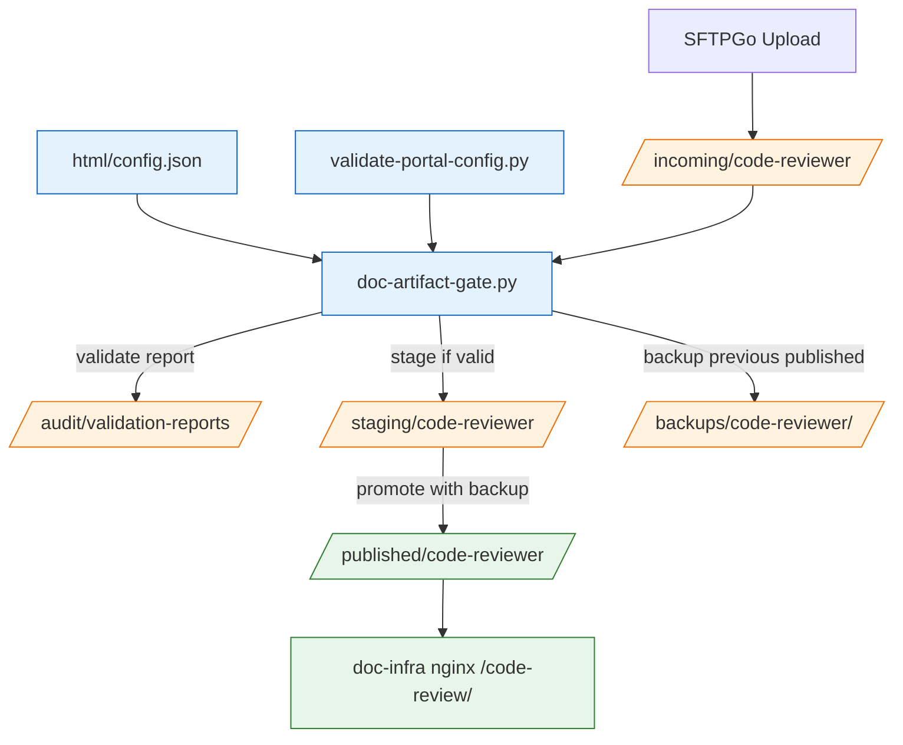

# Phase 5 Task Plan — Validator / Promote Gate（Planning Only）

日期：2026-07-02  
狀態：Planning Only / Pending User Approval for Implementation  
上位設計：`docs/arch/doc_infra_docs_hub_migration_hld.md`  
上一階段 handoff：`docs/agent_context/phase4_sftpgo_controlled_upload_implementation/phase_handoff.md`  
風險分級：🔴 HIGH — 會建立 `incoming -> staging -> published` 發布閘門，若實作錯誤可能公開未驗證內容或破壞既有文件。  
本文件目的：Phase 5 規劃，不直接實作。

---

## 1. 需求確認

### 1.1 任務目標

Phase 5 目標是設計一個可審計、可回滾的 Validator / Promote Gate，讓 Phase 4 的 SFTPGo upload 內容可以從 non-public `incoming/` 經過驗證後進入 `staging/`，再由明確 promote 動作發布到 `published/`。

核心流程：

```text
incoming/{project}/
  -> validate artifact
  -> staging/{project}/
  -> promote with backup
  -> published/{project}/
```

Phase 5 MVP 建議仍採 CLI/manual gate，不新增常駐 API 或 public UI。

### 1.2 成功標準（規劃階段）

| 項目 | 成功標準 |
|---|---|
| Handoff | 已讀 Phase 4 PASS handoff |
| Gate 定義 | 明確定義 validate、stage、promote、rollback 邊界 |
| 安全控制 | 定義 file allowlist、secret scan、path traversal、size limit、index.html 檢查 |
| Metadata 整合 | 重用 Phase 3 `html/config.json` / `validate-portal-config.py`，不另建 project mapping |
| Audit | 定義 validation report、promote log、backup manifest |
| Rollback | promote 前必須建立 backup，可回復上一版 published artifact |
| Scope | MVP 先以 `code-reviewer` 為 pilot |

---

## 2. 現有系統架構掃描

### 2.1 已讀取檔案

| 檔案 | 觀察 |
|---|---|
| `docs/agent_context/phase4_sftpgo_controlled_upload_implementation/phase_handoff.md` | Phase 4 PASS；SFTPGo upload target 為 non-public incoming；Phase 5 需設計 validator/promote |
| `docs/arch/sftpgo_upload_permission_hld.md` | 定義前端分離、role matrix、incoming/staging/published boundary |
| `docs/arch/portal_metadata_schema.md` | `html/config.json` 是 portal metadata manifest；定義 `publish_state`, `static_root`, `path` |
| `scripts/validate-portal-config.py` | 可驗證 portal metadata 與 nginx alias 一致性；Phase 5 可作 preflight |
| `scripts/publish-local-artifact.sh` | Phase 2 pilot copy script；有 forbidden scan，但 source/target hardcoded，不足以作 Phase 5 gate |
| `docker-compose.yml` | SFTPGo mount incoming/staging/audit，不 mount published；nginx only reads public root |
| `html/config.json` | `code-reviewer` 為 `published`，`static_root=/doc-sites/code-reviewer/` |

### 2.2 Phase 4 runtime 起點

```text
SFTPGo
  -> /srv/doc-infra/data/incoming
  -> /srv/doc-infra/data/staging
  -> /srv/doc-infra/data/audit

doc-infra nginx
  -> /doc-sites = ${DOC_INFRA_PUBLIC_ROOT:-/home/ubuntu/doc-sites} read-only
```

重要安全條件：

1. SFTPGo 不能寫 `published/`。
2. `incoming/` 不公開。
3. `/files/` 與 `/projects/` 仍 404。

---

## 3. 建議 Phase 5 MVP 架構

### 3.1 推薦策略：CLI/manual gate first

Phase 5 MVP 不建議一開始做 event rule 自動 promote。建議新增明確 CLI：

```text
scripts/validate-upload-artifact.py
scripts/promote-artifact.sh
```

或合併為一個 CLI：

```text
scripts/doc-artifact-gate.py validate --project code-reviewer
scripts/doc-artifact-gate.py stage --project code-reviewer
scripts/doc-artifact-gate.py promote --project code-reviewer
scripts/doc-artifact-gate.py rollback --project code-reviewer --backup <id>
```

建議 MVP 採用 **single Python CLI**，理由：

1. 可集中處理 JSON report、metadata、path normalization。
2. 比 shell 更容易做 negative tests。
3. 可重用 Python stdlib，不新增依賴。
4. 後續可被 SFTPGo event rule / cron / CI 呼叫。

### 3.2 目標資料流



### 3.3 State model

| State | Location | Trigger | Public? |
|---|---|---|---|
| uploaded | `incoming/{project}` | SFTPGo upload | no |
| validated | report under `audit/validation-reports` | validator PASS | no |
| staged | `staging/{project}` | stage command | no |
| published | `published/{project}` | promote command | yes |
| rolled_back | `published/{project}` restored from backup | rollback command | yes |
| rejected | report FAIL, optional quarantine | validator FAIL | no |

---

## 4. Proposed CLI Contract

### 4.1 Script path

推薦新增：

```text
scripts/doc-artifact-gate.py
```

### 4.2 Commands

```bash
python3 scripts/doc-artifact-gate.py validate --project code-reviewer
python3 scripts/doc-artifact-gate.py stage --project code-reviewer
python3 scripts/doc-artifact-gate.py promote --project code-reviewer
python3 scripts/doc-artifact-gate.py rollback --project code-reviewer --backup <backup-id>
```

### 4.3 Environment / default roots

| Env | Default | Purpose |
|---|---|---|
| `DOC_INFRA_INCOMING_ROOT` | `/srv/doc-infra/data/incoming` | uploaded source |
| `DOC_INFRA_STAGING_ROOT` | `/srv/doc-infra/data/staging` | validated candidate |
| `DOC_INFRA_PUBLIC_ROOT` | `/home/ubuntu/doc-sites` or `/srv/doc-infra/data/published` | published target |
| `DOC_INFRA_AUDIT_ROOT` | `/srv/doc-infra/data/audit` | reports/logs |
| `DOC_INFRA_BACKUP_ROOT` | `/srv/doc-infra/data/backups` | published backups |

注意：目前 local fallback `DOC_INFRA_PUBLIC_ROOT` 在 compose 使用 `/home/ubuntu/doc-sites`，Cloud VM 推薦 `/srv/doc-infra/data/published`。DeveloperPrompt 必須要求讀取 `.env.example`、`docker-compose.yml`，避免硬猜。

---

## 5. Validation Rules

### 5.1 Artifact structure checks

| Rule | Requirement |
|---|---|
| source exists | `incoming/{project}` exists |
| source not empty | at least 1 file |
| index required | `index.html` exists at root |
| no traversal | no path contains `..`, absolute path, control chars |
| no symlink escape | reject symlinks for MVP |
| max files | configurable, MVP default <= 2000 files |
| max total bytes | configurable, MVP default <= 200 MB |

### 5.2 File allowlist

MVP allowlist：

```text
.html, .htm, .css, .js, .json, .png, .jpg, .jpeg, .gif, .svg, .webp, .ico, .pdf, .txt, .md, .woff, .woff2, .ttf, .map
```

禁止：

```text
.env, .pem, .key, .p12, .pfx, .sqlite, .db, .py, .sh, .bash, .zsh, .php, .rb, .go, .rs, .java, .class, .jar, .zip, .tar, .gz, .7z
```

註：Archive extraction guard 放 Phase 5 MVP 禁止 archives，避免 zip-slip 類問題。

### 5.3 Secret scan patterns

MVP 必須掃描文字檔內容：

```text
BEGIN .*PRIVATE KEY
AWS_ACCESS_KEY_ID
AWS_SECRET_ACCESS_KEY
AKIA[0-9A-Z]{16}
password\s*=\s*['\"]?[^\s'"]+
token\s*=\s*['\"]?[^\s'"]+
api[_-]?key\s*=\s*['\"]?[^\s'"]+
NGROK_AUTHTOKEN
```

若命中，validate FAIL，不 stage、不 promote。

### 5.4 Metadata checks

Validator 必須：

1. 呼叫或重用 `scripts/validate-portal-config.py` 邏輯，確保 portal metadata 仍 PASS。
2. 確認 `project` 存在於 `html/config.json`。
3. MVP 只允許 `code-reviewer`，除非 User 另行核准。
4. 確認 project `publish_state=published` 且 `static_root` 是 `/doc-sites/code-reviewer/`。
5. 確認 target publish path 對應 `${DOC_INFRA_PUBLIC_ROOT}/code-reviewer/`。

---

## 6. Promote / Rollback Design

### 6.1 Stage

`stage` 命令：

1. 執行 validate。
2. 清空 temporary stage：`staging/{project}.tmp`。
3. copy incoming → `staging/{project}.tmp`。
4. rename to `staging/{project}`。
5. 寫入 validation report：
   ```text
   audit/validation-reports/{project}-{timestamp}.json
   ```

### 6.2 Promote

`promote` 命令：

1. 確認 `staging/{project}/index.html` 存在。
2. 重新 validate staging content。
3. 備份目前 published：
   ```text
   backups/{project}/{timestamp}/
   ```
4. copy staging → `published/{project}.tmp`。
5. atomic-ish swap：
   - move current `published/{project}` to backup or already copied backup。
   - move tmp to `published/{project}`。
6. 寫入 promote log：
   ```text
   audit/promote-log.jsonl
   ```
7. 不自動修改 nginx conf；`/code-review/` route 已指向 `/doc-sites/code-reviewer/`。

### 6.3 Rollback

`rollback` 命令：

1. 指定 backup id。
2. 備份目前 current published 作 rollback-before state。
3. restore backup → `published/{project}`。
4. 寫入 audit log。

---

## 7. 輸出欄位設計

### 7.1 Validation report JSON

```json
{
  "project": "code-reviewer",
  "timestamp": "2026-07-02T00:00:00Z",
  "source": "/srv/doc-infra/data/incoming/code-reviewer",
  "result": "PASS",
  "file_count": 12,
  "total_bytes": 123456,
  "checks": {
    "index_html": "PASS",
    "extension_allowlist": "PASS",
    "secret_scan": "PASS",
    "path_safety": "PASS",
    "metadata": "PASS"
  },
  "errors": []
}
```

### 7.2 Promote log JSONL

```json
{"timestamp":"2026-07-02T00:00:00Z","project":"code-reviewer","action":"promote","staging":"...","published":"...","backup":"...","result":"PASS"}
```

---

## 8. 驗收標準與測試類別覆蓋矩陣

### 8.1 可量化 metrics

| Metric | Standard |
|---|---|
| validate good artifact | exit 0 |
| validate bad artifact | exit non-0 |
| stage good artifact | creates `staging/code-reviewer/index.html` |
| promote good staging | `/code-review/` remains 200 and content updated |
| rollback | restores previous content |
| no direct public on upload | uploading to incoming alone does not affect `/code-review/` |
| audit | validation report + promote log created |
| security routes | `/files/`, `/projects/`, `/incoming/` non-200 |

### 8.2 測試類別覆蓋矩陣 — validation report fields

| 測試類別 | 檢查問題 | 測試案例 | 通過標準 |
|---|---|---|---|
| 🟢 正面測試 | good artifact PASS | fixture with root `index.html` and allowed assets | report `result=PASS`, exit 0 |
| 🔴 負面測試 | bad artifact FAIL | fixture with `.env` or private key | report `result=FAIL`, no staging |
| 📏 範圍測試 | size/file count limits | fixture > max bytes or max files | FAIL with clear error |
| 🎯 正確性測試 | metadata target matches route | `code-reviewer` maps to `/doc-sites/code-reviewer/` | PASS only if config validator PASS |
| 🔲 邊界測試 | empty/missing source | no incoming dir or no files | FAIL, no side effects |

### 8.3 測試類別覆蓋矩陣 — promote/rollback

| 測試類別 | 檢查問題 | 測試案例 | 通過標準 |
|---|---|---|---|
| 🟢 正面測試 | promote valid staging | stage then promote | published updated, HTTP 200 |
| 🔴 負面測試 | invalid staging not promoted | staging contains forbidden file | promote fails, published unchanged |
| 📏 範圍測試 | only approved project | attempt `--project unknown` | exit non-0 |
| 🎯 正確性測試 | backup matches previous published | compare backup index to pre-promote | identical |
| 🔲 邊界測試 | rollback missing backup | invalid backup id | exit non-0, published unchanged |

---

## 9. Validate Gate 定義

Phase 5 implementation 後 QA 必須檢查：

1. Phase 4 handoff 為 PASS。
2. CLI 不新增 public service/port。
3. Good fixture validate/stage/promote PASS。
4. Bad fixtures FAIL 且沒有 side effects。
5. Promote 前建立 backup。
6. Rollback 可恢復上一版。
7. Audit report/log 存在且欄位正確。
8. `/files/`, `/projects/`, `/incoming/` 仍 non-200。
9. Existing routes still 200。
10. No secrets committed。
11. No SFTPGo direct published write。
12. `development_log.md` 記錄所有命令。

反饋迴圈：retry_count 初始 0；max_retry=3；超過升級 User。

---

## 10. 風險分級與 HITL 模式

風險：🔴 HIGH。

理由：

1. Promote 會改變 public content。
2. Validator 若錯誤會導致未驗證 artifact 公開。
3. Rollback/backup 若錯誤會造成文件遺失。

HITL 建議：

```text
Implementation 前需 User 核准 Phase 5 MVP scope。
Promote command 預設需 explicit --confirm。
```

---

## 11. 任務邊界與禁止事項

### 11.1 Phase 5 MVP 要做

1. 新增 validator/promote CLI。
2. 以 `code-reviewer` pilot。
3. 產生 audit report/log。
4. 支援 backup/rollback。
5. 更新 README / HLD / development log。

### 11.2 Phase 5 MVP 不做

1. 不新增常駐服務或 public API。
2. 不新增 portal upload UI。
3. 不自動接 SFTPGo event rules。
4. 不處理多 project generalization，除非 User 另行核准。
5. 不啟用 email notification。
6. 不改 nginx public routes。
7. 不移除 legacy `/projects` mount。
