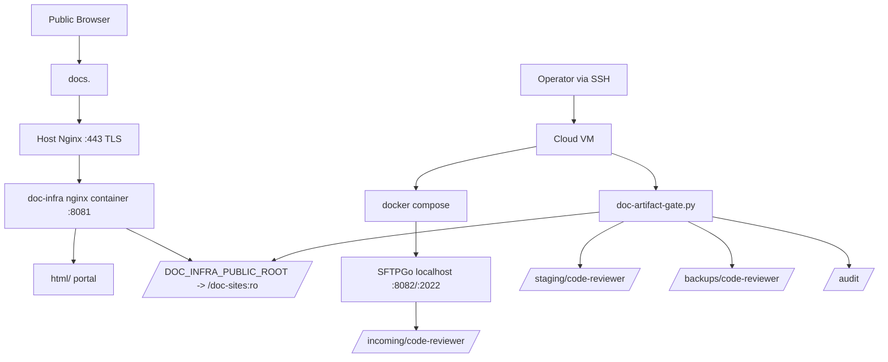

# Phase 6 Task Plan — First Deploy & Operational Readiness（Planning Only）

日期：2026-07-02  
狀態：Planning Only / Pending User Approval for Deployment Execution  
上位設計：`docs/arch/doc_infra_docs_hub_migration_hld.md`  
上一階段 handoff：`docs/agent_context/phase5_validator_promote_gate_implementation/phase_handoff.md`  
風險分級：🟡 MEDIUM — 不新增功能，但會規劃 Cloud VM/domain/TLS/SFTPGo/gate 的第一版部署驗收；實際部署需 User 提供環境與核准。

---

## 1. 需求確認

### 1.1 背景

Phase 1–5 已完成受控文件發布 MVP：

```text
SFTPGo upload -> incoming -> validate -> staging -> promote -> published -> rollback
```

但目前尚未完成「第一版可用部署」驗收，因此不應急著做多 project、自動化 event、review UI、Pagefind 等優化。

Phase 6 目標是把目前 MVP 變成一套可部署、可驗收、可回滾、可交接的第一版運維流程。

### 1.2 Phase 6 目標

1. 產出 First Deploy runbook。
2. 定義 Cloud VM / local production-like deployment checklist。
3. 定義 `code-reviewer` end-to-end operational drill。
4. 定義 smoke test、rollback drill、backup restore drill。
5. 定義 go/no-go criteria。
6. 明確列出 deployment 需要 User 提供的資訊。

### 1.3 成功標準

| 項目 | 成功標準 |
|---|---|
| Runbook | 有一份可照做的 first deploy runbook |
| Environment checklist | 明確列出 VM、domain、TLS、firewall、filesystem、Docker prerequisites |
| Smoke tests | 本地與 Cloud VM smoke test commands 完整 |
| E2E drill | `code-reviewer` 從 upload/incoming 到 promote/public 到 rollback 流程明確 |
| Security gate | `/files/`, `/projects/`, `/incoming/` 必須 non-200 |
| Rollback | container rollback、artifact rollback、host nginx rollback 都有步驟 |
| Approval | 實際部署前需 User 確認 domain/VM/access/secret handling |

---

## 2. 系統架構掃描

### 2.1 已讀取檔案

| 檔案 | 觀察 |
|---|---|
| `docs/agent_context/phase5_validator_promote_gate_implementation/phase_handoff.md` | Phase 5 PASS；gate CLI 可用；known minor 為 broken symlink skip |
| `docs/arch/doc_infra_docs_hub_migration_hld.md` | 定義 `/srv/doc-infra/data/{incoming,staging,published,metadata,search-index,backups}` 與階段推進規則 |
| `docs/arch/sftpgo_upload_permission_hld.md` | 定義 SFTPGo first-run setup、user/group/folder checklist、SFTPGo localhost-only |
| `docs/arch/validator_promote_gate_hld.md` | 定義 Phase 5 gate CLI、validation、promote、rollback、安全路由 |
| `README.md` | 已有 Phase 1 Cloud VM、Phase 4 SFTPGo、Phase 5 gate 操作段落 |
| `.env.example` | 已具備 DOC_INFRA / SFTPGo / Gate placeholders |
| `docker-compose.yml` | nginx/ngrok/sftpgo services；SFTPGo localhost binding；public root read-only to nginx |

### 2.2 目前已完成能力

| 能力 | 狀態 |
|---|---|
| Public portal | ✅ nginx :8081 |
| Published root abstraction | ✅ `DOC_INFRA_PUBLIC_ROOT` |
| SFTPGo upload surface | ✅ localhost-bound MVP |
| Portal metadata validator | ✅ `scripts/validate-portal-config.py` |
| Artifact gate | ✅ `scripts/doc-artifact-gate.py` |
| Rollback | ✅ gate CLI rollback |
| Cloud VM actual deployment | ⏳ 尚未實測 |
| Host Nginx + TLS actual validation | ⏳ 尚未實測 |
| SFTPGo users/groups first-run | ⏳ 尚需 manual validation |

---

## 3. Phase 6 建議架構與流程

### 3.1 Deployment topology



### 3.2 Phase 6 操作階段

| Stage | 目的 | 是否改功能 |
|---|---|---:|
| A. Preflight | 檢查 VM、DNS、Docker、ports、env、目錄 | 否 |
| B. Bootstrap | 建立 `/srv/doc-infra` 目錄與 `.env` | 否 |
| C. Deploy containers | `docker compose up -d` | 否 |
| D. Host Nginx/TLS | 設定 `docs.<domain>` reverse proxy | Host config only |
| E. SFTPGo first-run | 建 admin/user/group/folder | Manual config |
| F. E2E drill | code-reviewer upload/validate/stage/promote | 資料操作 |
| G. Rollback drill | artifact rollback | 資料操作 |
| H. Sign-off | 保存結果與 runbook | 否 |

---

## 4. Phase 6 不做什麼

1. 不做多 project gate。
2. 不做 SFTPGo event automation。
3. 不做 reviewer dashboard / staging preview UI。
4. 不做 Pagefind。
5. 不改 portal UI。
6. 不新增 public upload path。
7. 不把 SFTPGo 暴露到 public internet；若需要 `upload.docs.<domain>`，另開 phase/approval。
8. 不處理 Cloud provider IaC；本階段先 runbook/manual deployment。

---

## 5. First Deploy Runbook 規劃

Phase 6 implementation 建議新增：

```text
docs/arch/first_deploy_operational_runbook.md
```

必須包含以下章節。

### 5.1 Preflight Checklist

| 檢查 | 命令/方式 | 通過標準 |
|---|---|---|
| VM access | SSH login | 可登入 |
| Docker | `docker --version` | installed |
| Compose | `docker compose version` | installed |
| Repo | `git status` | expected branch/clean or documented changes |
| DNS | `dig docs.<domain>` | points to VM public IP |
| Ports | `ss -tlnp` | 80/443 available for Host Nginx; 8081 local for container |
| Disk | `df -h` | enough free space |
| Time | `timedatectl` | NTP synced |

### 5.2 Directory Bootstrap

```bash
sudo mkdir -p /srv/doc-infra/data/{incoming/code-reviewer,staging,published,metadata,search-index,backups,audit}
sudo mkdir -p /srv/doc-infra/sftpgo
sudo chown -R $(id -u):$(id -g) /srv/doc-infra/data /srv/doc-infra/sftpgo
```

禁止以 `chmod 777` 作正式基線。

### 5.3 `.env` Setup

```bash
cp .env.example .env
chmod 600 .env
```

必須人工填入：

| Env | 說明 |
|---|---|
| `NGROK_AUTHTOKEN` | 若使用 ngrok |
| `DOC_INFRA_DOMAIN` | `docs.<domain>` |
| `DOC_INFRA_PUBLIC_ROOT` | `/home/ubuntu/doc-sites` |
| `SFTPGO_BIND_ADDRESS` | 預設 `127.0.0.1` |

### 5.4 Container Deployment

```bash
docker compose config
docker compose up -d
docker compose ps
docker exec doc-infra-nginx nginx -t
```

### 5.5 Host Nginx + TLS

Host Nginx reverse proxy：

```nginx
server {
    listen 443 ssl;
    server_name docs.example.com;
    location / {
        proxy_pass http://127.0.0.1:8081;
        proxy_set_header Host $host;
        proxy_set_header X-Real-IP $remote_addr;
        proxy_set_header X-Forwarded-For $proxy_add_x_forwarded_for;
        proxy_set_header X-Forwarded-Proto $scheme;
    }
}
```

### 5.6 SFTPGo First-run Manual Checklist

沿用 Phase 4 HLD：

1. 開 `http://127.0.0.1:8082`。
2. 建 admin 強密碼，不寫入 repo。
3. 建 `code-reviewer` group。
4. 建 `code-reviewer-uploader` user。
5. 設 `/incoming/code-reviewer/` virtual folder。
6. 驗證不能寫 `published/`。

### 5.7 E2E Code-reviewer Drill

```bash
# 1. Seed or upload artifact into incoming/code-reviewer
python3 scripts/doc-artifact-gate.py validate --project code-reviewer
python3 scripts/doc-artifact-gate.py stage --project code-reviewer
python3 scripts/doc-artifact-gate.py promote --project code-reviewer --confirm
curl -s -o /dev/null -w "%{http_code}" https://docs.<domain>/code-review/
```

### 5.8 Rollback Drill

```bash
python3 scripts/doc-artifact-gate.py rollback --project code-reviewer --backup <backup-id> --confirm
curl -s -o /dev/null -w "%{http_code}" https://docs.<domain>/code-review/
```

---

## 6. 驗收標準與測試類別覆蓋矩陣

### 6.1 可量化 Metrics

| Metric | Standard |
|---|---|
| local compose config | exit 0 |
| containers | nginx, ngrok(optional), sftpgo running |
| local portal | `http://localhost:8081/` 200 |
| local route | `/code-review/` 200 |
| security routes | `/files/`, `/projects/`, `/incoming/` non-200 |
| gate validate/stage/promote | exit 0 for code-reviewer |
| rollback drill | exit 0 and route still 200 |
| domain | `https://docs.<domain>/` 200 if Cloud VM/domain available |
| TLS | certificate valid if Cloud VM/domain available |

### 6.2 測試類別覆蓋矩陣 — Deployment Outputs

| 測試類別 | 檢查問題 | 測試案例 | 通過標準 |
|---|---|---|---|
| 🟢 正面測試 | first deploy 可成功啟動 | docker compose up + curl `/` | 200 |
| 🔴 負面測試 | private paths 不公開 | curl `/files/`, `/projects/`, `/incoming/` | non-200 |
| 📏 範圍測試 | SFTPGo 不 public bind | inspect compose/ss | 127.0.0.1 only |
| 🎯 正確性測試 | `/code-review/` 反映 promoted artifact | promote後 curl route | 200 + expected content marker |
| 🔲 邊界測試 | rollback drill | rollback backup id | content restored / route 200 |

### 6.3 測試類別覆蓋矩陣 — Runbook Completeness

| 測試類別 | 檢查問題 | 測試案例 | 通過標準 |
|---|---|---|---|
| 🟢 正面測試 | 新操作者可照 runbook 部署 | dry-run checklist | steps complete |
| 🔴 負面測試 | secrets 不被寫入 repo | scan README/runbook | no real credentials |
| 📏 範圍測試 | 不含優化功能 | grep multi-project/event/pagefind | marked out-of-scope |
| 🎯 正確性測試 | runbook 命令與實際檔案一致 | compare env/compose/scripts | names match |
| 🔲 邊界測試 | Cloud VM 不可用時如何處理 | mark manual validation pending | no false PASS |

---

## 7. Validate Gate 定義

Phase 6 implementation 後 QA 必須檢查：

1. Phase 5 handoff PASS。
2. First deploy runbook exists and complete。
3. No new feature creep：no multi-project, no event automation, no UI。
4. Local production-like smoke tests pass。
5. Gate E2E drill for code-reviewer documented and/or executed。
6. Rollback drill documented and/or executed。
7. If Cloud VM/domain not accessible in environment，must mark as Manual Pending，不可假裝 PASS。
8. Security routes remain non-200。
9. No secrets in docs。
10. Known minor broken symlink issue either fixed or explicitly carried forward。

---

## 8. 風險分級與 HITL

風險：🟡 MEDIUM。

原因：

1. 本階段主要是 runbook/smoke/deploy readiness，不新增核心功能。
2. 若執行 Cloud VM 實際部署，涉及 domain/TLS/infra，因此需要 User 提供資料與確認。

HITL：

```text
Planning -> 可直接完成
Actual Cloud VM deployment -> 需要 User 提供 VM/domain/SSH/DNS 狀態並明確核准
```

---

## 9. User 需提供/確認

若要執行實際 first deploy，需要 User 確認：

1. Cloud VM SSH access 是否可用。
2. Domain 名稱，例如 `docs.example.com`。
3. DNS A record 是否已指向 VM。
4. 是否使用 ngrok 作 interim public access。
5. 是否允許 Host Nginx / certbot 設定。
6. SFTPGo admin 初始設定由誰操作。
7. 是否允許在 VM 上建立 `/srv/doc-infra`。
