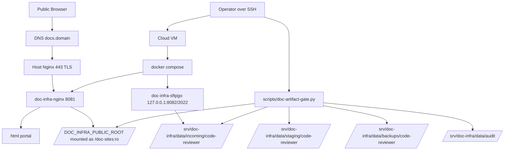

# First Deploy Operational Runbook — doc-infra Phase 6

狀態：Operational Readiness Runbook / Deployment requires User approval  
建立日期：2026-07-02  
Pilot project：`code-reviewer`  
適用範圍：Cloud VM 或 production-like local deployment  
依賴階段：Phase 1–5 已完成並驗證

---

## 0. 執行前聲明

本 runbook 用於 **first deploy readiness**，不是功能開發。

### 禁止事項

1. 不得提交 `.env`、SFTPGo admin 密碼、SSH key、TLS private key。
2. 不得使用 `chmod 777` 作為正式權限基線。
3. 不得將 SFTPGo 綁定到 `0.0.0.0`，除非另開安全設計與 User approval。
4. 不得重新啟用 `/files/` 或 public `/projects/`。
5. 不得把 `incoming/`、`staging/`、`audit/`、`backups/` 暴露給 public nginx。

---

## 1. Deployment Topology



---

## 2. Go / No-Go Preconditions

| Item | Required | Command / Evidence | Go Standard |
|---|:---:|---|---|
| Phase 5 handoff | ✅ | `docs/agent_context/phase5_validator_promote_gate_implementation/phase_handoff.md` | PASS |
| VM SSH access | Cloud deploy only | `ssh <vm>` | login succeeds |
| Docker | ✅ | `docker --version` | installed |
| Docker Compose | ✅ | `docker compose version` | installed |
| Repo | ✅ | `git status` | expected branch; uncommitted changes documented |
| Domain DNS | Cloud deploy only | `dig docs.<domain>` | points to VM public IP |
| Host Nginx | Cloud deploy only | `nginx -v` | installed or install approved |
| TLS | Cloud deploy only | certbot / existing cert | valid cert path or certbot approved |
| Disk | ✅ | `df -h /srv` | enough free space for docs/backups |
| Time sync | Recommended | `timedatectl` | NTP active |

If Cloud VM/domain/TLS access is not available, mark these rows **Manual Pending**. Do not mark first deploy as PASS.

---

## 3. Host Directory Bootstrap

Cloud VM recommended root：

```text
/srv/doc-infra/data
```

Create required directories:

```bash
sudo mkdir -p /srv/doc-infra/data/{incoming/code-reviewer,staging,metadata,search-index,backups,audit}
mkdir -p /home/ubuntu/doc-sites
sudo mkdir -p /srv/doc-infra/sftpgo
sudo chown -R "$(id -u):$(id -g)" /srv/doc-infra/data /srv/doc-infra/sftpgo
sudo chown -R "$(id -u):$(id -g)" /home/ubuntu/doc-sites
```

Verify:

```bash
test -d /srv/doc-infra/data/incoming/code-reviewer
test -d /srv/doc-infra/data/staging
test -d /home/ubuntu/doc-sites
test -d /srv/doc-infra/data/backups
test -d /srv/doc-infra/data/audit
test -d /srv/doc-infra/sftpgo
```

> Production hardening may replace `chown` with user/group-specific ownership plus `setfacl`. Do not use `chmod 777` as baseline.

---

## 4. Environment Setup

Start from the committed template:

```bash
cd /home/ubuntu/projects/doc-infra
cp .env.example .env
chmod 600 .env
```

Minimum Cloud VM values:

```env
NGROK_AUTHTOKEN=your_ngrok_auth_token_here
DOC_INFRA_DATA_ROOT=/srv/doc-infra/data
DOC_INFRA_PUBLIC_ROOT=/home/ubuntu/doc-sites
DOC_INFRA_DOMAIN=docs.example.com
DOC_INFRA_INCOMING_ROOT=/srv/doc-infra/data/incoming
DOC_INFRA_STAGING_ROOT=/srv/doc-infra/data/staging
DOC_INFRA_AUDIT_ROOT=/srv/doc-infra/data/audit
SFTPGO_HTTP_PORT=8082
SFTPGO_SFTP_PORT=2022
SFTPGO_BIND_ADDRESS=127.0.0.1
SFTPGO_CONFIG_ROOT=/srv/doc-infra/sftpgo
DOC_INFRA_BACKUP_ROOT=/srv/doc-infra/data/backups
DOC_INFRA_GATE_MAX_FILES=2000
DOC_INFRA_GATE_MAX_BYTES=209715200
```

Secret handling check:

```bash
git status --short .env
```

Expected: no tracked `.env` change. `.env` must remain ignored.

---

## 5. Container Deployment

Validate compose and start services:

```bash
cd /home/ubuntu/projects/doc-infra
docker compose config
docker compose up -d
docker compose ps
docker exec doc-infra-nginx nginx -t
```

Expected services:

| Container | Expected State |
|---|---|
| `doc-infra-nginx` | running |
| `doc-infra-ngrok` | running if `NGROK_AUTHTOKEN` is valid |
| `doc-infra-sftpgo` | running |

SFTPGo must be localhost-bound:

```bash
docker compose ps sftpgo
```

Expected effective published ports:

```text
127.0.0.1:8082->8080/tcp
127.0.0.1:2022->2022/tcp
```

---

## 6. Local Smoke Test

Run from repo root:

```bash
python3 scripts/validate-portal-config.py

curl -s -o /dev/null -w "%{http_code}\n" http://localhost:8081/
curl -s -o /dev/null -w "%{http_code}\n" http://localhost:8081/code-review/

# Forbidden / non-public routes
curl -s -o /dev/null -w "%{http_code}\n" http://localhost:8081/files/
curl -s -o /dev/null -w "%{http_code}\n" http://localhost:8081/projects/
curl -s -o /dev/null -w "%{http_code}\n" http://localhost:8081/incoming/
```

Expected:

| URL | Expected |
|---|---:|
| `/` | 200 |
| `/code-review/` | 200 after artifact is promoted |
| `/files/` | non-200, usually 404 |
| `/projects/` | non-200, usually 404 |
| `/incoming/` | non-200 |

If `/code-review/` is not yet promoted, run the E2E drill in section 9 before finalizing sign-off.

---

## 7. Host Nginx + TLS Setup（Cloud VM Only）

> Requires explicit User approval before modifying host nginx/certbot.

Example reverse proxy config at `/etc/nginx/sites-available/docs`:

```nginx
server {
    listen 443 ssl;
    server_name docs.example.com;

    ssl_certificate /etc/letsencrypt/live/docs.example.com/fullchain.pem;
    ssl_certificate_key /etc/letsencrypt/live/docs.example.com/privkey.pem;

    location / {
        proxy_pass http://127.0.0.1:8081;
        proxy_set_header Host $host;
        proxy_set_header X-Real-IP $remote_addr;
        proxy_set_header X-Forwarded-For $proxy_add_x_forwarded_for;
        proxy_set_header X-Forwarded-Proto $scheme;
    }
}

server {
    listen 80;
    server_name docs.example.com;
    return 301 https://$host$request_uri;
}
```

Enable:

```bash
sudo ln -s /etc/nginx/sites-available/docs /etc/nginx/sites-enabled/docs
sudo nginx -t
sudo systemctl reload nginx
```

Certbot first issue / renew check:

```bash
sudo certbot --nginx -d docs.example.com
sudo certbot renew --dry-run
```

---

## 8. SFTPGo First-run Checklist

SFTPGo is available only from the host by default:

| Interface | URL / Host |
|---|---|
| WebAdmin | `http://127.0.0.1:8082/webadmin` |
| WebClient | `http://127.0.0.1:8082/webclient` |
| SFTP | `127.0.0.1:2022` |

Manual setup:

1. Open WebAdmin from the VM or via SSH tunnel.
2. Create admin user with strong password.
3. Create group: `code-reviewer`.
4. Create user: `code-reviewer-uploader`.
5. Assign only the incoming virtual folder for the pilot:

```text
/srv/doc-infra/data/incoming/code-reviewer
```

6. Verify uploader cannot write these roots:

```text
/home/ubuntu/doc-sites
/srv/doc-infra/data/staging
/srv/doc-infra/data/backups
/srv/doc-infra/data/audit
```

No SFTPGo credentials may be committed to git.

---

## 9. `code-reviewer` E2E Drill

### 9.1 Seed artifact for first deploy

If SFTP upload is not yet available, seed a minimal fixture manually:

```bash
mkdir -p /srv/doc-infra/data/incoming/code-reviewer
cat > /srv/doc-infra/data/incoming/code-reviewer/index.html <<'EOF'
<!doctype html>
<html><head><meta charset="utf-8"><title>code-reviewer first deploy</title></head>
<body><h1>code-reviewer first deploy</h1></body></html>
EOF
```

### 9.2 Validate → Stage → Promote

```bash
cd /home/ubuntu/projects/doc-infra
python3 scripts/doc-artifact-gate.py validate --project code-reviewer
python3 scripts/doc-artifact-gate.py stage --project code-reviewer
python3 scripts/doc-artifact-gate.py promote --project code-reviewer --confirm
```

Verify local route:

```bash
curl -s -o /dev/null -w "%{http_code}\n" http://localhost:8081/code-review/
```

Expected: `200`.

Verify audit artifacts:

```bash
ls /srv/doc-infra/data/audit/validation-reports/
test -f /srv/doc-infra/data/audit/promote-log.jsonl
ls /srv/doc-infra/data/backups/code-reviewer/
```

---

## 10. Cloud Domain Smoke Test（Cloud VM Only）

Replace `docs.example.com` with the real domain:

```bash
curl -s -o /dev/null -w "%{http_code}\n" https://docs.example.com/
curl -s -o /dev/null -w "%{http_code}\n" https://docs.example.com/code-review/

# Forbidden routes
curl -s -o /dev/null -w "%{http_code}\n" https://docs.example.com/files/
curl -s -o /dev/null -w "%{http_code}\n" https://docs.example.com/projects/
curl -s -o /dev/null -w "%{http_code}\n" https://docs.example.com/incoming/
```

Expected:

| URL | Expected |
|---|---:|
| `/` | 200 |
| `/code-review/` | 200 |
| `/files/` | non-200 |
| `/projects/` | non-200 |
| `/incoming/` | non-200 |

TLS check:

```bash
curl -sI https://docs.example.com/ | grep -Ei 'HTTP/|strict-transport-security|server:'
```

Note: HSTS may be absent unless explicitly configured. Absence of HSTS is not a first deploy blocker unless required by policy.

---

## 11. Rollback Drill

List backups:

```bash
ls /srv/doc-infra/data/backups/code-reviewer/
```

Inspect manifest:

```bash
cat /srv/doc-infra/data/backups/code-reviewer/<backup-id>/manifest.json
```

Rollback:

```bash
cd /home/ubuntu/projects/doc-infra
python3 scripts/doc-artifact-gate.py rollback --project code-reviewer --backup <backup-id> --confirm
```

Verify route remains available:

```bash
curl -s -o /dev/null -w "%{http_code}\n" http://localhost:8081/code-review/
```

Expected: `200`.

---

## 12. Failure Handling

### 12.1 Container deployment failure

```bash
docker compose ps
docker compose logs nginx
docker compose logs sftpgo
docker compose down
```

### 12.2 Host Nginx failure

```bash
sudo nginx -t
sudo rm -f /etc/nginx/sites-enabled/docs
sudo systemctl reload nginx
```

### 12.3 Artifact promote failure

The gate is fail-closed. If `promote` fails, `published/code-reviewer` should remain at the old version.

Check:

```bash
ls -la /home/ubuntu/doc-sites/code-reviewer
tail -n 20 /srv/doc-infra/data/audit/promote-log.jsonl
```

### 12.4 Full artifact rollback

Use section 11 rollback with a known good backup id.

---

## 13. First Deploy Sign-off Record

Copy this table into the phase development log after execution.

| Check | Result | Evidence |
|---|:---:|---|
| `docker compose config` | ⏳ | |
| containers running | ⏳ | |
| portal `/` local 200 | ⏳ | |
| `/code-review/` local 200 | ⏳ | |
| `/files/` non-200 | ⏳ | |
| `/projects/` non-200 | ⏳ | |
| `/incoming/` non-200 | ⏳ | |
| SFTPGo localhost-bound | ⏳ | |
| `validate` PASS | ⏳ | |
| `stage` PASS | ⏳ | |
| `promote` PASS | ⏳ | |
| rollback drill PASS | ⏳ | |
| Cloud domain `/` 200 | Manual Pending | |
| Cloud domain `/code-review/` 200 | Manual Pending | |
| TLS valid | Manual Pending | |
| no secrets committed | ⏳ | |

---

## 14. Go / No-Go Decision

GO only if:

1. Local smoke passes.
2. `code-reviewer` E2E drill passes.
3. Rollback drill passes.
4. Forbidden routes remain non-public.
5. SFTPGo remains localhost-bound.
6. Cloud VM checks either PASS or explicitly documented as Manual Pending.
7. No secrets are committed.

If any critical security route is exposed (`/files/`, `/projects/`, `/incoming/`), decision is **NO-GO**.
