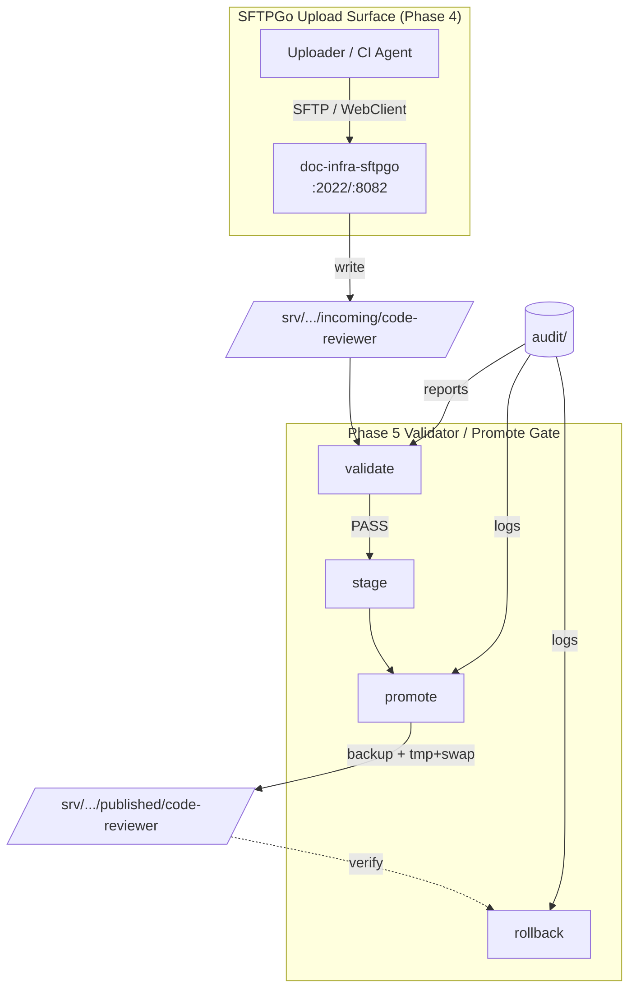

# Validator / Promote Gate HLD — Phase 5 MVP

日期：2026-07-02
Phase：Phase 5 Validator / Promote Gate MVP
依據：`docs/agent_context/phase5_validator_promote_gate_planning/implementation_approval_request.md`

---

## 1. 架構圖



### 目錄流向

```
incoming/code-reviewer/
        |
        v
   [validate]
        |
   staging/code-reviewer/
        |
        v
   [promote] --> backup/code-reviewer/{backup_id}/
        |
        v
published/code-reviewer/  (nginx serves /code-review/ -> /doc-sites/code-reviewer/)
```

---

## 2. CLI Contract

```bash
# Validate incoming artifact (read-only check)
python3 scripts/doc-artifact-gate.py validate --project code-reviewer

# Copy incoming -> staging (after validate PASS)
python3 scripts/doc-artifact-gate.py stage --project code-reviewer

# Promote staging -> published (requires --confirm, creates backup)
python3 scripts/doc-artifact-gate.py promote --project code-reviewer --confirm

# Rollback published to a specific backup (requires --backup <id> and --confirm)
python3 scripts/doc-artifact-gate.py rollback --project code-reviewer --backup <backup-id> --confirm
```

### Exit Codes

| Code | Meaning |
|------|---------|
| 0 | Operation succeeded |
| 1 | Validation failure or operation failure |
| 2 | Missing required arguments |
| 3 | Project not allowed (MVP only supports code-reviewer) |

---

## 3. Environment Roots

| Variable | Default | Description |
|----------|---------|-------------|
| `DOC_INFRA_INCOMING_ROOT` | `/srv/doc-infra/data/incoming` | Upload target |
| `DOC_INFRA_STAGING_ROOT` | `/srv/doc-infra/data/staging` | Review/staging area |
| `DOC_INFRA_PUBLIC_ROOT` | `/home/ubuntu/doc-sites` | Published artifact root |
| `DOC_INFRA_AUDIT_ROOT` | `/srv/doc-infra/data/audit` | Validation reports & promote logs |
| `DOC_INFRA_BACKUP_ROOT` | `/srv/doc-infra/data/backups` | Promote/rollback backups |
| `DOC_INFRA_GATE_MAX_FILES` | `2000` | Max file count per artifact |
| `DOC_INFRA_GATE_MAX_BYTES` | `209715200` | Max total bytes (200 MiB) |

---

## 4. Validation Rules

Every `validate` (and `stage`) run checks:

| # | Rule | Fail action |
|---|------|------------|
| 1 | Source `incoming/{project}/` exists | FAIL |
| 2 | Source is non-empty | FAIL |
| 3 | Root `index.html` exists | FAIL |
| 4 | No symlinks in artifact | FAIL |
| 5 | No path traversal (`../`) / absolute paths / control chars | FAIL |
| 6 | No forbidden extension (`.env`, `.pem`, `.key`, `.sh`, `.py`, etc.) | FAIL |
| 7 | File count ≤ `DOC_INFRA_GATE_MAX_FILES` | FAIL |
| 8 | Total bytes ≤ `DOC_INFRA_GATE_MAX_BYTES` | FAIL |
| 9 | No secret patterns (private key, AWS keys, `password=`, `token=`, etc.) | FAIL |
| 10 | Portal metadata preflight via `validate-portal-config.py` | WARN (non-blocking) |
| 11 | Project is `code-reviewer` (MVP hard gate) | exit 3 before mutation |

### Extension Policy

**Allowlist:**
`.html`, `.htm`, `.css`, `.js`, `.json`, `.png`, `.jpg`, `.jpeg`, `.gif`, `.svg`, `.webp`, `.ico`, `.pdf`, `.txt`, `.md`, `.woff`, `.woff2`, `.ttf`, `.map`

**Denylist (always fail):**
`.env`, `.pem`, `.key`, `.p12`, `.pfx`, `.sqlite`, `.db`, `.py`, `.sh`, `.bash`, `.zsh`, `.php`, `.rb`, `.go`, `.rs`, `.java`, `.class`, `.jar`, `.zip`, `.tar`, `.gz`, `.7z`

### Secret Patterns

```
BEGIN .*PRIVATE KEY
AWS_ACCESS_KEY_ID
AWS_SECRET_ACCESS_KEY
AKIA[0-9A-Z]{16}
password\s*=\s*['"]?[^\s'"]+
token\s*=\s*['"]?[^\s'"]+
api[_-]?key\s*=\s*['"]?[^\s'"]+
NGROK_AUTHTOKEN
```

---

## 5. Promote Safe-Write Sequence

```
1. validate staging/{project}/  → must PASS
2. backup current published/{project}/  → backups/{project}/{backup_id}/
3. write backup manifest.json (project, backup_id, created_at, file_count, total_bytes)
4. copy staging/{project}/  →  published/{project}.tmp
5. verify tmp: index.html exists AND passes validation
6. swap: published/{project}.tmp  →  published/{project}/
7. write promote log: audit/promote-log.jsonl
```

**Forbidden (non-atomic):**
```bash
rm -rf published/{project} && cp -r staging/{project} published/{project}
```

---

## 6. Rollback Safe-Write Sequence

```
1. verify backup id format (must be a directory under backups/{project}/)
2. read backups/{project}/{backup_id}/manifest.json
3. assert manifest["project"] == requested project  (fail-closed if mismatch)
4. backup current published/{project}/  →  backups/{project}/pre-rollback-{timestamp}/
5. restore backup  →  published/{project}.tmp
6. verify tmp: index.html exists AND passes validation
7. swap: published/{project}.tmp  →  published/{project}/
8. write rollback log: audit/promote-log.jsonl
```

**Constraint:** CLI only accepts `backup_id`, not arbitrary paths. The backup must exist under `${DOC_INFRA_BACKUP_ROOT}/${project}/`.

---

## 7. Fail-Closed Rules

| Operation | On failure |
|-----------|-----------|
| `validate` | Writes FAIL report only; no staging/published mutation |
| `stage` | No published mutation |
| `promote` | Published remains old version; audit log records failure |
| `rollback` | Published remains current version; audit log records failure |

---

## 8. Audit / Backup Format

### Validation Report

```
${DOC_INFRA_AUDIT_ROOT}/validation-reports/{project}-{timestamp}.json
```

```json
{
  "project": "code-reviewer",
  "timestamp": "2026-07-02T12:00:00Z",
  "passed": true,
  "errors": [],
  "warnings": [],
  "file_count": 42,
  "total_bytes": 1048576
}
```

### Promote / Rollback Log

```
${DOC_INFRA_AUDIT_ROOT}/promote-log.jsonl
```

```jsonl
{"timestamp":"...","action":"promote","project":"code-reviewer","backup_id":"...","success":true,"detail":"..."}
{"timestamp":"...","action":"rollback","project":"code-reviewer","backup_id":"...","success":true,"detail":"..."}
```

### Backup Manifest

```
${DOC_INFRA_BACKUP_ROOT}/{project}/{backup_id}/manifest.json
```

```json
{
  "project": "code-reviewer",
  "backup_id": "pre-20260702T120000Z-a1b2c3d4",
  "created_at": "2026-07-02T12:00:00Z",
  "file_count": 42,
  "total_bytes": 1048576
}
```

---

## 9. Safety Checks (Public Routes)

After any gate operation, these routes must remain non-200:

| Route | Expected | Reason |
|-------|----------|--------|
| `/files/` | 404 | Security: was a data leak vector |
| `/projects/` | 404 | Security: legacy source tree |
| `/incoming/` | non-200 | Security: draft upload area |
| `/code-review/` | 200 | Must remain functional |

---

## 10. Known Limitations

| Limitation | Reason |
|------------|--------|
| MVP only supports `code-reviewer` | Pilot project; other projects require scope expansion |
| No SFTPGo event-rule automation | Manual CLI or external scheduler only |
| No email / notification | Deferred to Phase 5+ |
| No multi-project | Hard gate until explicitly approved |
| Rollback only accepts `backup_id` | No arbitrary path restore |
| Portal metadata preflight is non-blocking (warning only) | Avoid blocking valid artifacts due to config issues |

---

## 11. Files Modified / Added

| File | Action |
|------|--------|
| `scripts/doc-artifact-gate.py` | **Added** — CLI gate |
| `.env.example` | **Modified** — added `DOC_INFRA_BACKUP_ROOT`, `DOC_INFRA_GATE_MAX_FILES`, `DOC_INFRA_GATE_MAX_BYTES` |
| `docs/arch/validator_promote_gate_hld.md` | **Added** — this HLD |
| `README.md` | **Modified** — added Phase 5 operations section |
| `docs/agent_context/phase5_validator_promote_gate_implementation/development_log.md` | **Modified** — test results |

---

*維護者：Developer Agent Phase 5*
